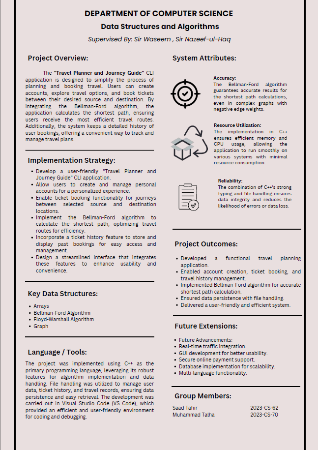
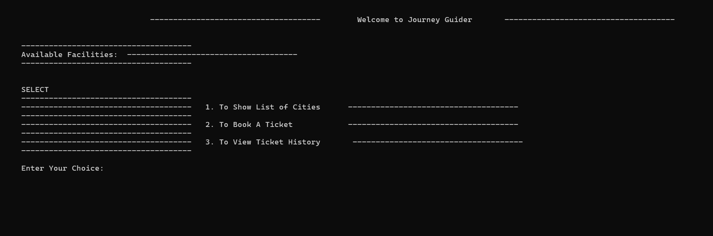
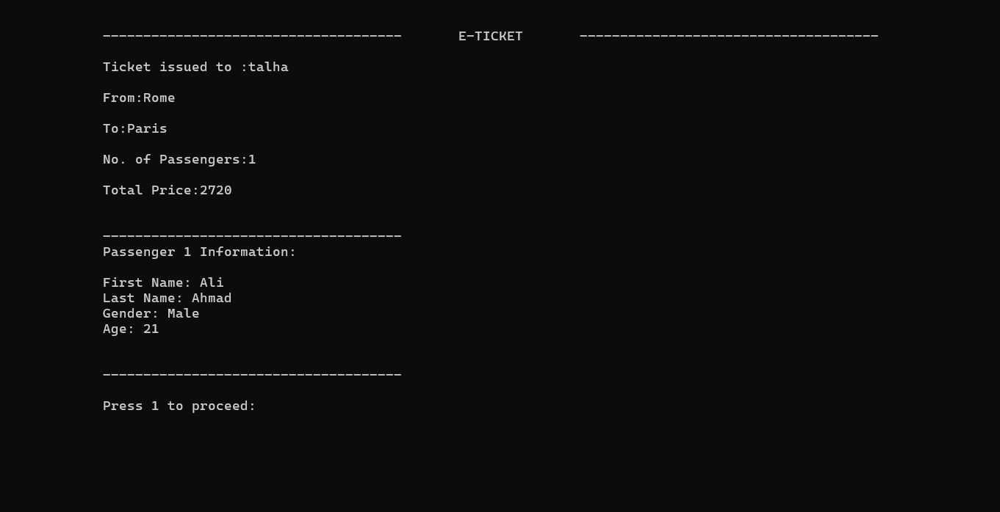
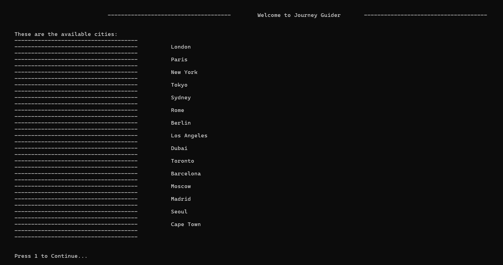

# Journey Guide

A C++ project designed to simplify airline ticketing and travel planning. It employs graph theory and algorithms like Bellman-Ford to calculate the shortest paths between destinations. The system also manages user credentials and ticket history for a seamless user experience.

## Table of Contents
- [Features](#features)
- [Poster](#poster)
- [Screenshots](#screenshots)
- [Documentation](#documentation)
- [Technologies Used](#technologies-used)
- [Usage](#usage)
- [Contributing](#contributing)

## Features
- Utilizes the Bellman-Ford and Floyd Warshall algorithm to determine the most efficient travel routes between destinations.
- Represents the airline network as a weighted graph for optimized pathfinding and route management.
- Handles user login credentials and maintains a history of booked tickets.
- Interactive console-based interface for ticket booking, cancellation, and viewing travel plans.

## Poster

## Screenshot

## Documentation
For a detailed overview of the project and its features, visit the [Documentation](./documentation/) in the repository.

## Technologies Used
- C++
## Usage
1. Clone the repository:
   `git clone https://github.com/miansaadtahir/JourneyGuide.git`
2. Navigate to the project directory:
   `cd .\src\`
3. Run the `main.exe` file.

## Contributing
Contributions, issues, and feature requests are welcome!  
Feel free to check out the [issues page](https://github.com/miansaadtahir/journeyguide/issues) for more information.
